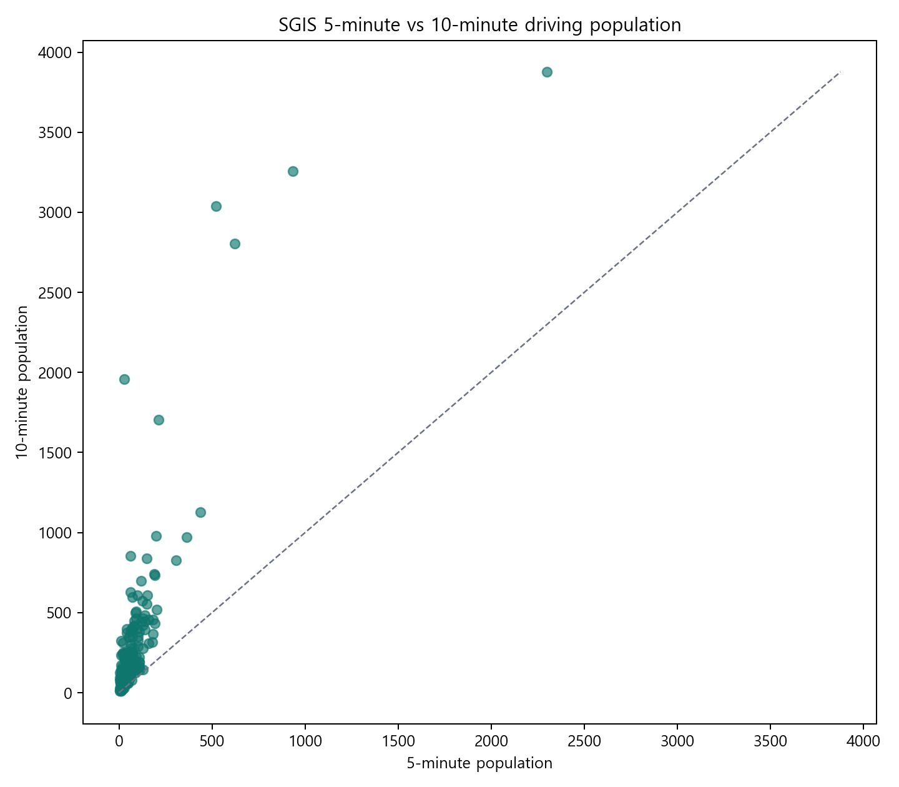

# 의성 지역자원 생활권 분석 · SGIS Web GIS

[공개 데모에서 SGIS 분석 보기](https://ssoyoum.github.io/Uiseong-Resource-Model/#analysis-d) · [전체 Web GIS](https://ssoyoum.github.io/Uiseong-Resource-Model/) · [분석 방법](docs/sgis-catchment-analysis.md)

의성군 전통수리시설 **못 427개**를 공간정보로 탐색하는 프로젝트입니다. [Uiseong-Young-Researchers](https://github.com/ssoyoum/Uiseong-Young-Researchers)의 연구·화면 구조를 바탕으로, 저장된 SGIS 주행생활권 인구 응답과 VWorld 주변 환경, 행정안전부 읍·면 인구를 연결했습니다. 화면은 HTML·CSS·JavaScript·Leaflet으로 만든 정적 Web GIS이며, SGIS API 호출은 사전 수집 과정에서만 수행합니다.

## 공개 화면에서 확인할 수 있는 것

- **지도:** 의성군 경계 내 못 427개, 읍·면 및 활용유형 필터, 시설별 상세정보.
- **SGIS 분석 D:** 2024년 5분·10분 주행생활권 인구 비교, 시설별 산점도, 10분 인구 및 5→10분 증가폭 조건에 따른 지도 필터.
- **정책 검토 E:** 6개 규칙기반 검토 맥락과 시설별 근거. 후보 탐색용이며 정책 우선순위 점수는 아닙니다.
- **도로·인구 F:** VWorld UQ151 최근접 도로까지의 유클리드거리와 행정안전부 읍·면 인구 변화. 도로거리는 네트워크 이동거리가 아닙니다.
- **출처·상태:** SGIS, VWorld, 행정안전부 자료의 출처와 기준연도, 미확보값의 의미.

분석 D는 화면 상단의 **SGIS 분석 보기** 또는 [직접 링크](https://ssoyoum.github.io/Uiseong-Resource-Model/#analysis-d)로 이동할 수 있습니다. 그래프의 점을 선택한 뒤 **지도에서 이 못 보기**를 누르면 해당 시설을 지도에서 확인할 수 있습니다.

## 검증된 SGIS 결과

| 항목 | 결과 | 해석 범위 |
| --- | ---: | --- |
| 의성군 경계 내 시설 | 427개 | 원 조사 시설 696개 중 분석에 사용한 시설 |
| 좌표 품질 조건 통과 | 380개 | 대표·인근·중복좌표 47개 제외 |
| 5분 생활권 인구 확보 | 175개 | 조건 통과 시설 기준 |
| 10분 생활권 인구 확보 | 190개 | 조건 통과 시설 기준 |
| 5분·10분 모두 확보 | 175개 | 산점도 비교 표본 |
| 두 생활권 모두 미확보 | 190개 | 0명으로 대체하지 않음 |
| 10분 생활권 인구 중앙값 | 153명 | 응답이 있는 190개 표본의 중앙값 |

SGIS 기준연도는 **2024년**입니다. 생활권은 서비스가 생성한 5분·10분 주행시간 권역이며, 수치는 해당 권역의 **저장된 인구 응답**입니다. 시설별 권역이 겹치므로 인구를 합산하지 않습니다. 시설 이용자·방문객 수 또는 실제 현장 주행시간을 측정한 값으로 해석하지 않습니다. 상세한 좌표 품질 및 미응답 진단은 [분석 기록](docs/sgis-catchment-analysis.md)과 [저장된 분석 요약](data/analysis/sgis_catchment_analysis.json)을 참고하세요.



## 자료와 산출물

| 자료 | 용도 | 근거 |
| --- | --- | --- |
| 의성 청년연구 못 위치·속성 | 시설 427개 공간 분석 | [시설 GeoJSON](data/geojson/ponds_classified.geojson) |
| SGIS 생활권역 서비스 · 2024년 | 5분·10분 주행생활권 인구 | [출처 manifest](data/manifests/sgis_sources.csv), [분석 CSV](data/analysis/sgis_catchment_analysis.csv) |
| VWorld UQ151·UQ164·UO601 | 도로 접근·주변 시설 맥락 | [출처 manifest](data/manifests/vworld_sources.csv), [접근성 CSV](data/analysis/pond_accessibility.csv) |
| 행정안전부 주민등록 인구 · 2024·2025년 12월 | 18개 읍·면 청년·고령 인구와 인구 변화 | [출처 manifest](data/manifests/population_sources.csv), [요약 JSON](data/analysis/population_summary.json) |

VWorld 주변시설 68개는 확보한 레이어의 의성군 범위 자료입니다. 읍·면 인구는 지역 배경지표이며 개별 못의 주변 인구가 아닙니다. 청년은 만 19~39세, 고령은 만 65세 이상으로 집계했습니다. 국내 공식 인구격자 기반의 시설별 500m·1km 인구는 `DATA_NOT_AVAILABLE`입니다. WorldPop 참고자료를 국내 공식 인구격자로 간주하지 않습니다.

정책 맥락은 [시설별 근거표](data/analysis/sgis_policy_evidence.csv)와 [분석 규칙](docs/sgis-policy-comparison.md)에서 확인할 수 있습니다. 규칙기반 분류는 현장 확인 대상을 정리하기 위한 것이며 자동 정책 선정이나 효과 검증을 뜻하지 않습니다.

## 실행과 검증

공개 화면만 실행할 때는 Python 3의 표준 라이브러리로 필요한 정적 파일을 모을 수 있습니다.

```powershell
python analysis/build_public_site.py --output _site
python -m http.server 8000 --bind 127.0.0.1 --directory _site
```

브라우저에서 `http://127.0.0.1:8000/`을 열면 됩니다. `build_public_site.py`는 SGIS 시설 ID·좌표 조건·응답 건수·정책 그룹 및 검증 보고서를 대조하고, 공개 화면에 필요한 파일만 `_site/`에 복사합니다. GitHub Pages 배포 설정은 [.github/workflows/pages.yml](.github/workflows/pages.yml)에 있습니다.

공간분석 산출물 전체를 재생성할 때는 저장소의 실제 원자료와 GIS 라이브러리가 필요합니다. 공개 저장소에 없는 원자료를 임의로 생성하지 않습니다.

```powershell
python analysis/run_competition_pipeline.py
```

검증 근거는 [파이프라인 보고서](data/analysis/validation_report.json)와 [SGIS 제출 검증 코드](analysis/validate_sgis_submission.py)에 있습니다. 현장 위치 확인, 공식 인구격자 확보, 정책 검토 결과의 후속 확인은 남아 있습니다.
